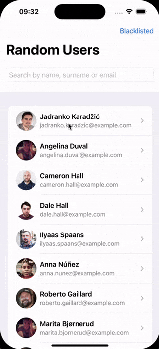

# RandomUser

A SwiftUI app demonstrating:
- **Clean Architecture** (Domain, Data, Presentation layers)  
- **SOLID Principles**  
- **RandomUser API** fetch with infinite scroll  
- **Deleting / Blacklisting users**  
- **Search** by name, surname, or email  
- **Local persistence** (UserDefaults)  
- **Unit Tests** for critical parts  

## Architecture
- **Domain**: Core logic and **User** entity.  
- **Data**: `UserRepositoryImplementation` unites Remote (`RandomUserAPIDataSource`) and Local (`UserDefaultsDataSource`).  
- **Presentation**: SwiftUI views + view models for listing, searching, and showing details.

## Features
1. **List of Random Users** (infinite scroll).  
2. **Tap for Detail View**.  
3. **Search / Filter** by name, surname, email.  
4. **Delete Users** (blacklist them).  
5. **Persist** stored and blacklisted users between launches.

## Preview

## Running & Testing
1. **Clone** or download the project.  
2. **Open in Xcode**, build & run (`Cmd+R`).  
3. **Run Tests** with `Cmd+U` or via the Xcode Test action.

## Next Steps
- More robust error handling.  
- Switch to a database (e.g. CoreData).  
- Advanced pagination.
- Add UI Tests
